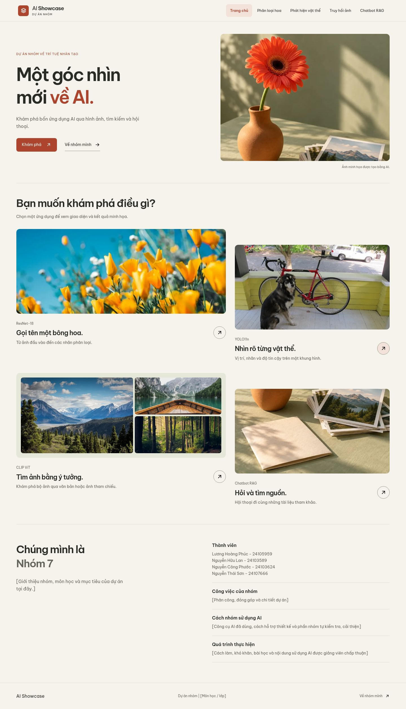
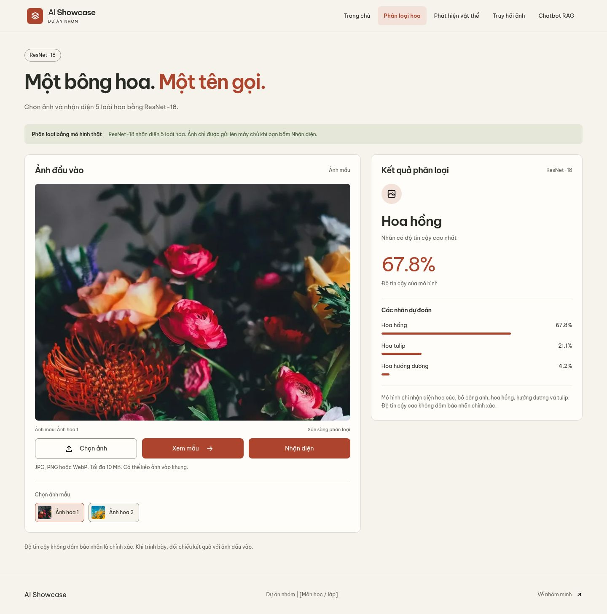
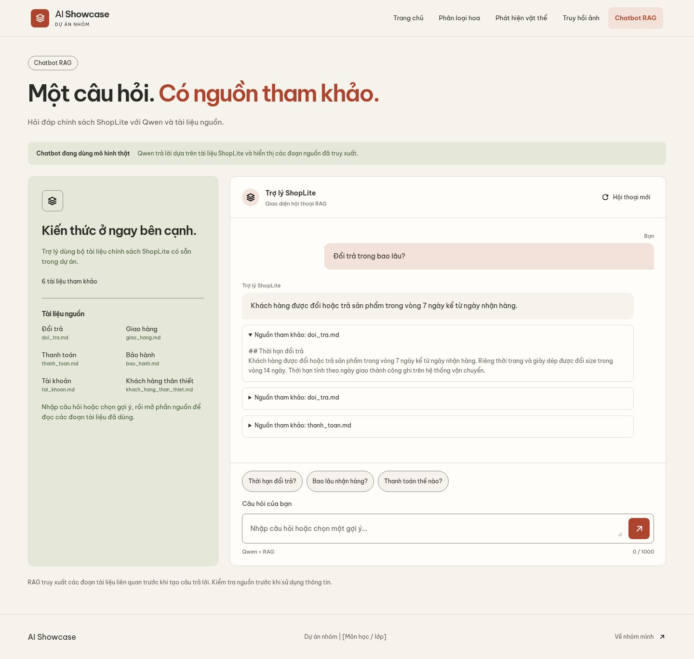
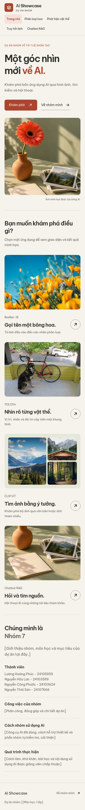
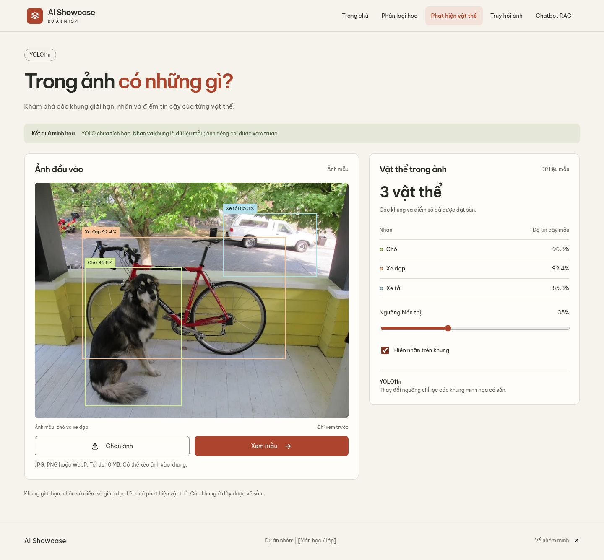
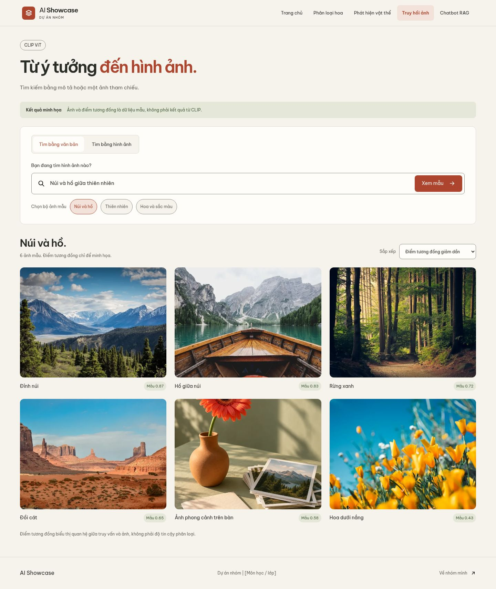

# AI Showcase

Giao diện web tiếng Việt cho dự án AI: phân loại hoa ResNet-18 và chatbot Qwen + RAG đã nối mô hình thật. FastAPI phục vụ cả `web/` và `/api/` trên cùng cổng. `streamlit_app.py` giữ tên cũ nhưng giờ là lệnh khởi động server; chạy bằng Python, không dùng `streamlit run`.

## Giao diện

Ảnh dưới đây được chụp từ ứng dụng đang chạy bằng Chromium/Playwright. Kết quả hoa và câu trả lời chat trong ảnh được tạo bởi mô hình thật.







<details>
<summary>Giao diện mobile và hai trang minh họa</summary>







</details>

## Tính năng

| Trang | Trạng thái |
|---|---|
| Phân loại hoa | Upload JPG/PNG/WebP tối đa 10 MB hoặc chọn ảnh mẫu; ResNet-18 trả top 3 nhãn và độ tin cậy |
| Chatbot RAG | Hỏi đáp tiếng Việt, stream câu trả lời, giữ lịch sử trong phiên và hiển thị nguồn từ 6 tài liệu ShopLite |
| Phát hiện vật thể | Minh họa khung, nhãn và bộ lọc ngưỡng; chưa tích hợp YOLO |
| Truy hồi ảnh | Minh họa thư viện, sắp xếp và hộp thoại ảnh; chưa tích hợp CLIP |

Classifier nhận diện 5 loài: hoa cúc, bồ công anh, hoa hồng, hướng dương và tulip. Ảnh ngoài các lớp này vẫn có thể bị phân loại nhầm; độ tin cậy không đảm bảo kết quả chính xác. Ảnh được gửi khi bấm **Nhận diện**, không được ghi thành tệp trên server. Lịch sử chat chỉ tồn tại trong phiên trang web.

## Chạy trên máy

Dùng Python 3.13 trở lên. Tại thư mục repo:

```bash
python -m venv .venv
source .venv/bin/activate
pip install -r requirements.txt
python streamlit_app.py
```

Nếu dùng uv, chạy `uv sync` rồi `uv run python streamlit_app.py`.

Mở **http://localhost:7860**. Các trang dùng đường dẫn hash: `#home`, `#flowers`, `#detection`, `#retrieval`, `#chat`. API ở `/docs`, trạng thái mô hình ở `/api/health`.

Lần đầu chạy, ứng dụng tải Qwen và mô hình embedding từ Hugging Face; server bắt đầu nhận request sau khi nạp mô hình. Checkpoint hoa đã có trong `artifacts/classifier/`, không cần huấn luyện lại. Nếu một mô hình không nạp được, xem log và `/api/health`; chức năng đó sẽ báo lỗi khi được gọi.

Trên NixOS, môi trường Python cần tìm được thư viện C++ qua `LD_LIBRARY_PATH`; xem [hướng dẫn NixOS về lỗi libstdc++.so.6](https://wiki.nixos.org/wiki/Python#ImportError:_libstdc++.so.6). `shell.nix` có thể giữ riêng trên máy và được bỏ qua bởi Git.

## Deploy Docker

```bash
docker build -t ai-showcase .
docker run --rm -p 7860:7860 ai-showcase
```

Docker chạy một server phục vụ cả web và API. Image chỉ chứa mã nguồn, giao diện, tài liệu ShopLite và checkpoint hoa; không chứa `.venv`, bộ ảnh huấn luyện hay ảnh chụp README.

Với [Hugging Face Docker Spaces](https://huggingface.co/docs/hub/spaces-sdks-docker), tạo Space có SDK **Docker** rồi đưa repo lên Space. README khai báo `app_port: 7860` khớp với cổng ứng dụng. Qwen mặc định dùng bản 0.5B trên CPU. Với nền tảng Docker khác, đặt `PORT` theo cổng mà nền tảng cung cấp.

| Biến môi trường | Mặc định | Ý nghĩa |
|---|---|---|
| `PORT` | `7860` | Cổng phục vụ web và API |
| `ENABLED_MODELS` | `llm,classifier` | Mô hình được nạp; đặt `classifier` để chỉ chạy phân loại hoa |
| `LLM_MODEL` | Qwen2.5 1.5B trên GPU / 0.5B trên CPU | Mô hình sinh câu trả lời; Docker mặc định 0.5B |
| `EMBED_MODEL` | `sentence-transformers/paraphrase-multilingual-MiniLM-L12-v2` | Mô hình truy xuất tài liệu |
| `HF_HOME` | Theo thư viện Hugging Face; Docker: `/app/.cache` | Thư mục cache mô hình |

## Dữ liệu và huấn luyện

Thêm hoặc sửa tài liệu Markdown trong `data/kb/`, dùng tiêu đề `##` để chia đoạn. Khởi động lại ứng dụng để xây lại chỉ mục RAG.

Bộ ảnh Flowers không được lưu trong bản repo hiện tại. Nếu muốn huấn luyện lại classifier:

```bash
python -m core.train_classifier --epochs 5 --batch-size 64
```

Lệnh tự tải dữ liệu và pretrained ResNet-18 khi chưa có; ghi checkpoint, danh sách lớp, metrics và cách chia tập vào `artifacts/classifier/`. Giữ `model.pt` và `classes.json` để deploy. `.venv/`, cache, `shell.nix`, dữ liệu huấn luyện và `split.json` được bỏ qua bởi Git. Dữ liệu đã commit trước đây vẫn tồn tại trong lịch sử Git.

## Kiểm tra

```bash
python -m unittest discover -s tests -v
```

Test API dùng mô hình giả lập, không tải mô hình. Để kiểm tra trình duyệt và API thật, chạy ứng dụng trước, rồi dùng Playwright/Chromium đã cài:

```bash
CHROMIUM_PATH=/path/to/chromium node web/check.cjs http://127.0.0.1:7860/
```

Có thể đặt `PLAYWRIGHT_MODULE` tới module Playwright ngoài repo. Đặt `SCREENSHOT_DIR=docs/screenshots` để chụp lại ảnh README. Bộ kiểm tra bao gồm 5 trang, 4 kích thước màn hình, sáng/tối, upload, API phân loại, chat stream/lịch sử/nguồn, xử lý lỗi và hiển thị văn bản an toàn.

Thông tin nhóm còn để trống trong `web/index.html`; điền tên nhóm, thành viên và phân công trước khi trình bày. Nguồn ảnh, phông và biểu tượng nằm trong [web/README.md](web/README.md).
